# 🏠 Housing Price Prediction — Live ML in Tableau via TabPy

## 📌 Project Overview

This project integrates **Python machine learning models** directly inside **Tableau** using **TabPy** (Tableau's Python Server). Two regression models were built and compared live inside the Tableau dashboard to predict house prices from the USA Housing dataset.

| Model | Variables Used | Purpose |
|---|---|---|
| **LR** — Simple Linear Regression | Avg. Area Income only | Baseline |
| **MLR** — Multiple Linear Regression | All features except Price | Full model |

---

## 📂 Repository Structure

```
├── USA_Housing.csv                               # Source dataset (5,000 rows, 7 fields)
├── Linear_Regression_Model.ipynb                 # Python notebook for model exploration
├── Housing_Price_Prediction_LiveModel.twb        # Tableau workbook — live TabPy predictions + dashboard
├── Housing_Price_Prediction_ModelEvaluation.twb  # Tableau workbook — error metrics (MSE, RMSE, MAE)
├── model_results.csv                             # Model output results
├── model_results_FINAL.csv                       # Final cleaned model results
├── Linear_Regression_on_Housing_Data.pdf         # Project report (PDF)
├── Linear_Regression_on_Housing_Data.docx        # Project report (Word)
├── screenshots/                                  # All project screenshots
└── README.md
```

---

## 📊 Dataset

**File:** `USA_Housing.csv` &nbsp;|&nbsp; **Rows:** 5,000 &nbsp;|&nbsp; **Fields:** 7

| Column | Description |
|---|---|
| `Avg. Area Income` | Average income of residents in the area |
| `Avg. Area House Age` | Average age of houses in the area |
| `Avg. Area Number of Rooms` | Average number of rooms per house |
| `Avg. Area Number of Bedrooms` | Average number of bedrooms per house |
| `Area Population` | Population of the area |
| `Price` | ✅ **Target variable** — House selling price |
| `Address` | Address of the house |

---

## ⚙️ Setup & Installation

### Prerequisites
- Python 3.x
- Tableau Desktop
- TabPy

### Step 1 — Install TabPy

```bash
python -m pip install --upgrade pip
pip install tabpy
```

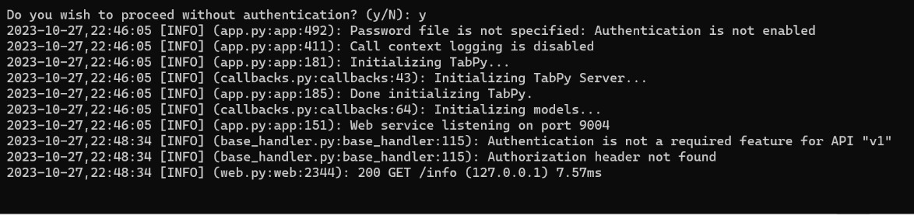

### Step 2 — Start the TabPy Server

```bash
tabpy
```

TabPy will listen on **port 9004**. You should see:
```
[INFO] Done initializing TabPy.
[INFO] Web service listening on port 9004
```

### Step 3 — Connect Tableau to TabPy

Go to **Help → Settings and Performance → Manage Analytics Extension Connection**, then select **TabPy**.

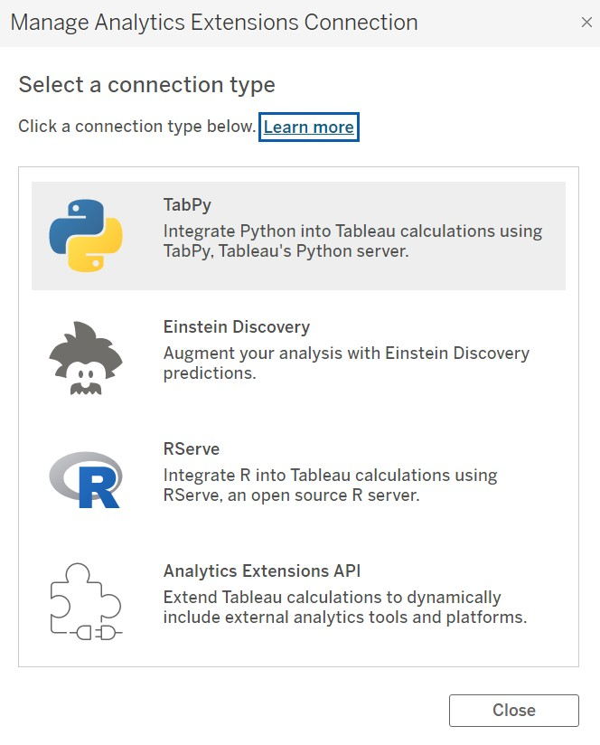

Set **Hostname:** `localhost` and **Port:** `9004`, then click **Test Connection**.

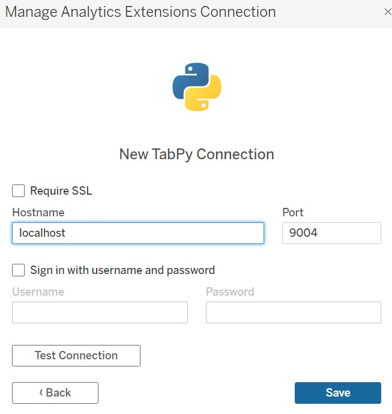

You should see a success confirmation:

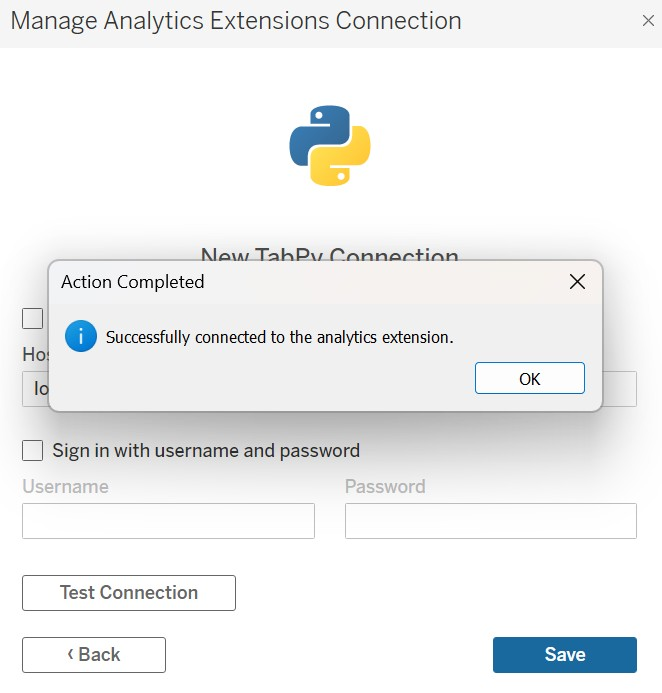

### Step 4 — Connect the Dataset

Open `Housing_Price_Prediction_LiveModel.twb` and connect it to `USA_Housing.csv`.

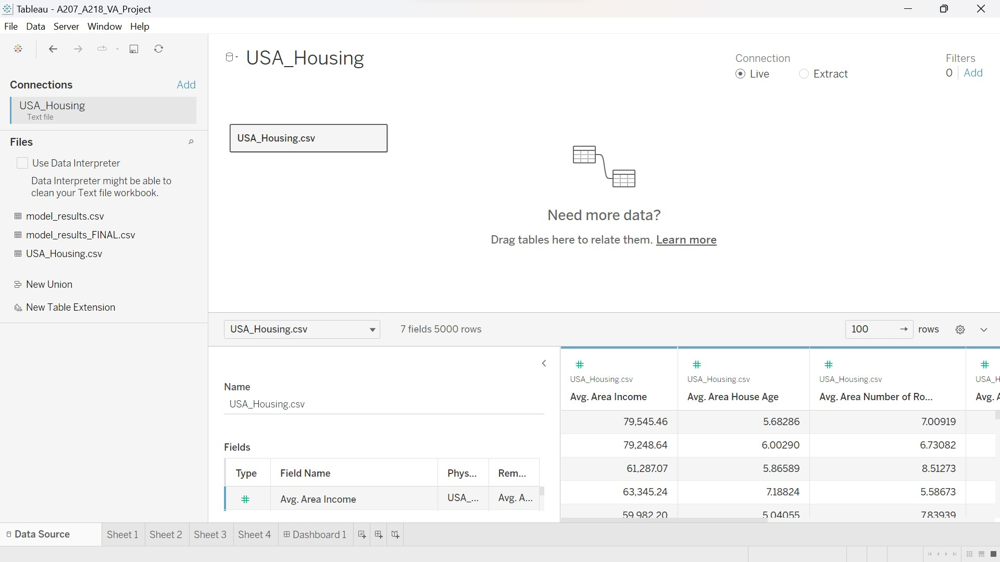

---

## 🧠 Model Scripts (SCRIPT_REAL via TabPy)

### Simple Linear Regression (LR)
> Trained on **Avg. Area Income** only

```python
import numpy as np
from sklearn import linear_model

lr = linear_model.LinearRegression()
X = np.transpose(np.array([_arg1]))
y = np.array(_arg2)
lr.fit(X, y)
return lr.predict(X).tolist()
```

**Tableau call:**
```
SCRIPT_REAL('<script>', AVG([Avg. Area Income]), SUM([Price]))
```

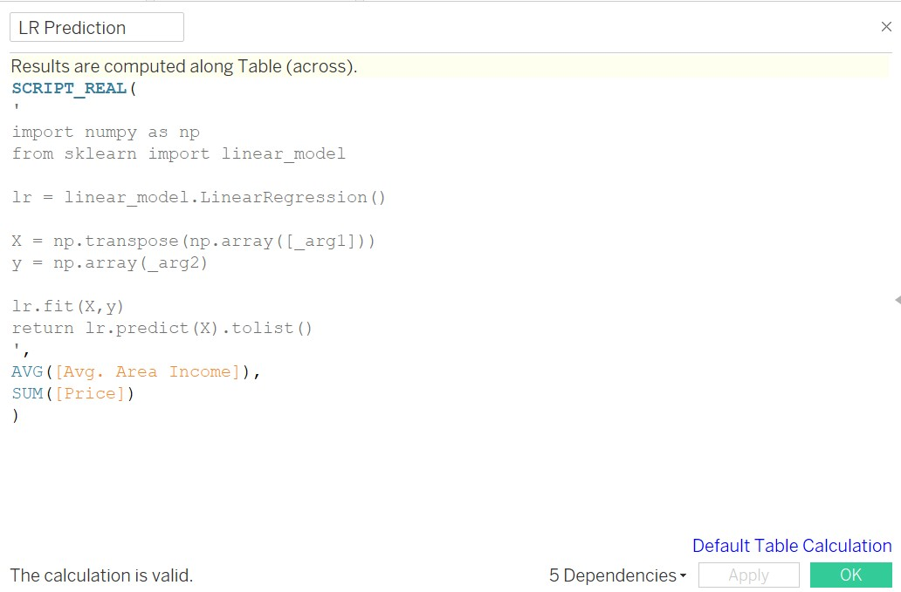

---

### Multiple Linear Regression (MLR)
> Trained on **all features** except Price

```python
import numpy as np
from sklearn.linear_model import LinearRegression

lr = LinearRegression()
X = np.column_stack((_arg1, _arg2, _arg3, _arg4, _arg5))
y = _arg6
lr.fit(X, y)
return lr.predict(X).tolist()
```

**Tableau call:**
```
SCRIPT_REAL('<script>',
    AVG([Avg. Area Income]),
    AVG([Avg. Area House Age]),
    AVG([Avg. Area Number of Rooms]),
    AVG([Avg. Area Number of Bedrooms]),
    AVG([Area Population]),
    SUM([Price])
)
```

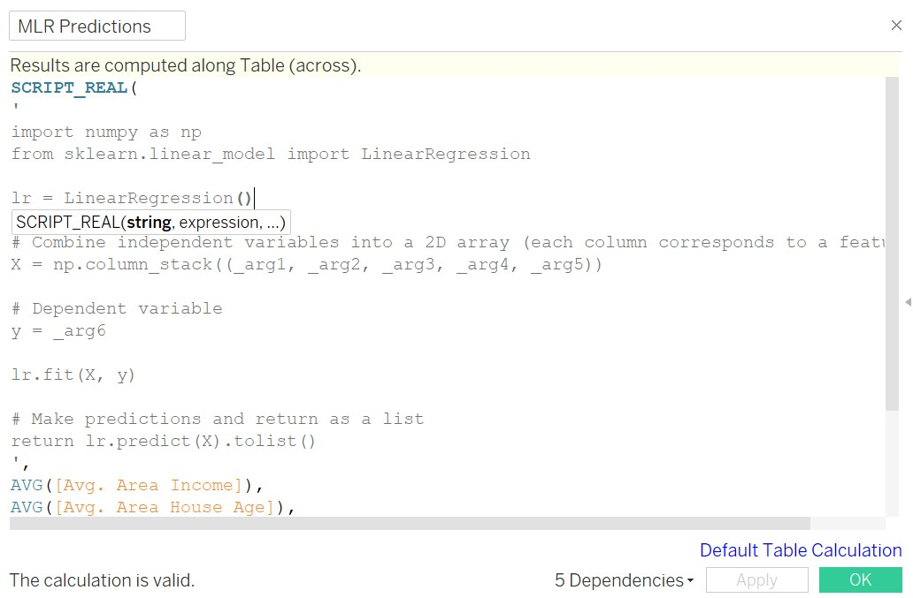

---

## 📈 Visualizations

### Sheet 1 — Prediction based on Avg. Area Income

Scatter plot comparing actual Price, LR Prediction, and MLR Predictions against Avg. Area Income.

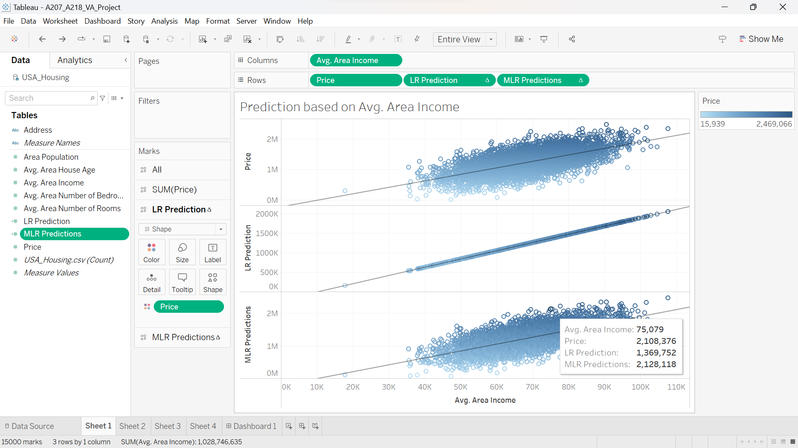

---

### Sheet 2 — House Age vs Price

Line chart comparing LR and MLR predictions across Avg. Area House Age.

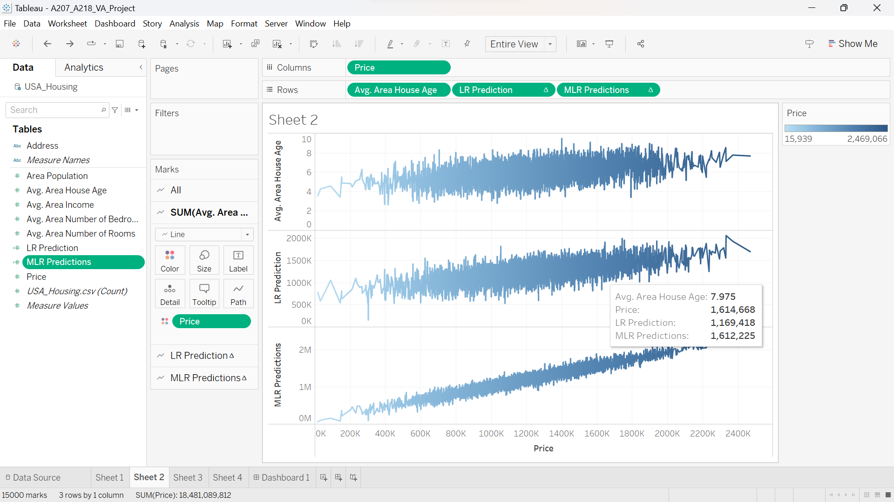

---

### Sheet 3 — Area Population vs Price

Scatter plot showing how Area Population correlates with actual price vs model predictions.

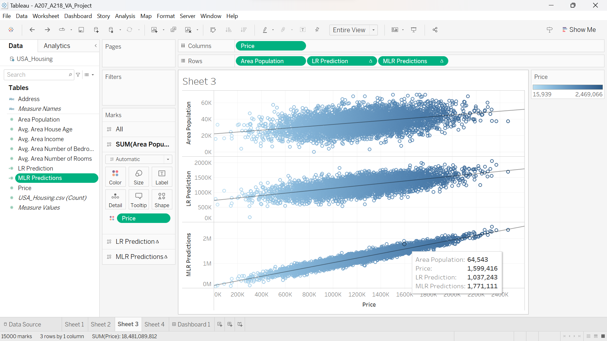

---

### Sheet 4 — Number of Bedrooms vs Price

Scatter plot of Avg. Area Number of Bedrooms vs Price, with LR and MLR overlaid.

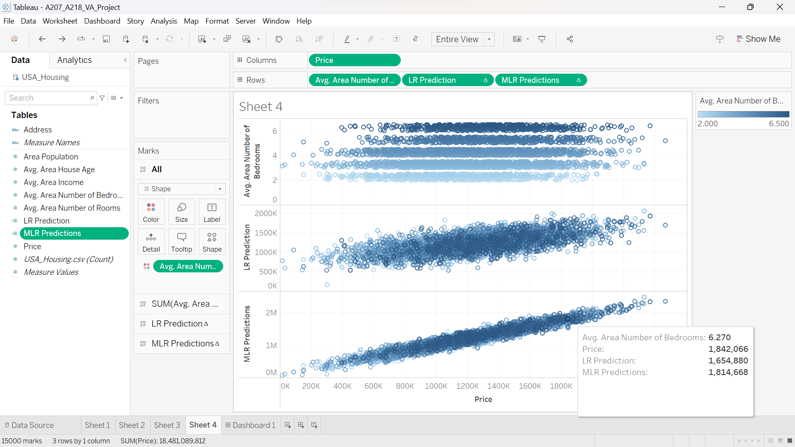

---

## 🔍 Results & Comparison

Sample prediction from **Sheet 1** at Avg. Area Income = $75,079:

| | Value |
|---|---|
| ✅ Actual Price | **$2,108,376** |
| 🔴 LR Prediction | **$1,369,752** *(off by ~$738K — trained on one variable)* |
| 🟢 MLR Prediction | **$2,128,118** *(off by only ~$20K — trained on all features)* |

**Conclusion:** MLR significantly outperforms simple LR. Training on a single variable (income) leaves too much variance unexplained, while MLR captures the combined effect of income, house age, rooms, bedrooms, and population — achieving near-perfect predictions.

---

## 🛠️ Tech Stack

| Tool | Purpose |
|---|---|
| **Python 3.x** | Model training |
| **scikit-learn** | `LinearRegression` implementation |
| **NumPy** | Array manipulation |
| **TabPy** | Python ↔ Tableau bridge |
| **Tableau Desktop** | Visualization & live dashboard |
| **Jupyter Notebook** | Exploratory analysis |

---

## 👤 Author

**Deep Prakashbhai Dobariya**
&nbsp;|&nbsp; [GitHub](https://github.com/DeepDobariya307)

---

## 📄 License

This project is for academic and educational purposes.
